# Energy-Charts-by-Lutarym

[English](README.md) · [Deutsch](README.de.md) · **Français** · [日本語](README.ja.md)

Carte Lovelace personnalisée pour Home Assistant. Une seule carte dont le
comportement se choisit avec `card_type` dans un formulaire de configuration
graphique. La plupart des types tracent des graphiques mensuels en barres
(année en cours contre jusqu'à 3 années précédentes), quelques-uns affichent
un rapport calculé (efficacité, autoconsommation, COP), et deux présentent un
résumé chiffré au lieu de barres (aperçu électricité, énergie par pièce). La
carte et son éditeur parlent quatre langues : anglais, allemand, français et
japonais. Ils suivent automatiquement `hass.language` ; tout autre réglage de
langue revient à l'anglais.

## Types de carte

Il existe 13 préréglages `card_type`. Chaque capture ci-dessous montre le
préréglage avec sa mise en forme par défaut ; couleur, titre et entité se
redéfinissent dans l'éditeur.

### autarkie — Autonomie

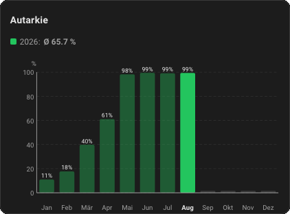

Moyenne mensuelle d'un capteur de taux d'autonomie en pourcentage. Axe Y fixe
0–100 %. La valeur annuelle est la moyenne, pas la somme.
Entité par défaut : `sensor.autarkie`.

### energy — Consommation électrique

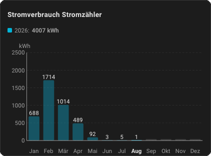

Consommation mensuelle en kWh (somme du mois). Axe Y mis à l'échelle
automatiquement.
Entité par défaut : `sensor.stromverbrauch`.

### pv — Production PV

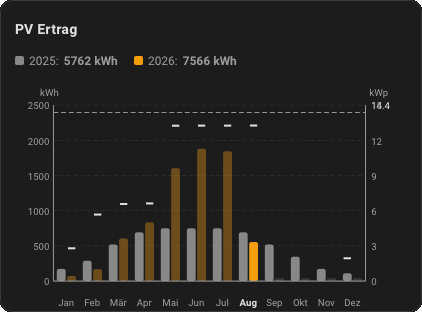

Production PV mensuelle en kWh (somme du mois). Deux superpositions
facultatives :

- `kwp` : puissance installée. Trace une ligne de référence en pointillés
  contre sa propre échelle en kW à droite.
- `power_entity` : un capteur de puissance instantanée (kW/W, `state_class:
  measurement`, p. ex. la puissance AC de l'onduleur). Affiche la pointe
  mensuelle sous forme de court trait sur chaque barre, sur la même échelle en
  kW à droite. Ce doit être une entité **distincte** du capteur de production :
  celui-ci est un compteur cumulatif en kWh dont seule la somme mensuelle a du
  sens, alors que seul un capteur de puissance instantanée fournit un maximum
  mensuel exploitable.

Entité par défaut : `sensor.pv_ertrag`.

### wallbox — Borne de recharge

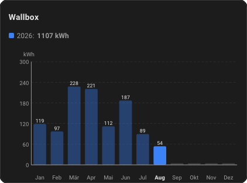

Énergie de charge mensuelle de la borne en kWh (somme du mois). Superposition
facultative :

- `distance_entity` : un compteur kilométrique ou un capteur de trajet. Trace
  une courbe des kilomètres parcourus sur sa propre échelle en km à droite
  (une somme mensuelle comme l'énergie de charge elle-même, la distance
  parcourue n'ayant pas de plage utile à l'intérieur du mois).

Entité par défaut : `sensor.wallbox`.

### wallbox_eff — Efficacité de charge

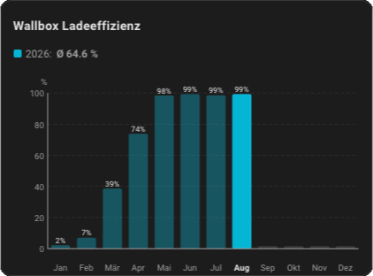

Part de la charge de la borne effectuée sans soutirage sur le réseau.
Graphique en barres fixe 0–100 % par mois. Nécessite deux entités :

- `entity` : énergie de charge totale de la borne (kWh).
- `grid_entity` : soutirage réseau, donné en **puissance** (W/kW) ou en
  **énergie** (kWh). La puissance est intégrée à partir des moyennes horaires
  enregistrées en kWh soutirés par mois (soutirage uniquement).

Valeur mensuelle = (1 − soutirage_kWh ÷ charge_kWh) × 100, bornée à 0–100.
Aucun soutirage dans le mois signifie 100 %.

La valeur annuelle de la ligne de synthèse est pondérée par l'énergie, soit
Σ kWh sans réseau ÷ Σ kWh chargés, et non la moyenne des taux mensuels.

### eigenverbrauch — Autoconsommation

Part de la production PV consommée sur place au lieu d'être injectée.
Graphique en barres fixe 0–100 % par mois. Nécessite deux entités :

- `entity` : production PV (kWh).
- `feedin_entity` : injection sur le réseau (kWh).

Valeur mensuelle = (PV − injection) ÷ PV × 100. Les deux valeurs sont mesurées
directement, le simple rapport mensuel est donc exact. La valeur annuelle est
pondérée par l'énergie comme ci-dessus.

### cop — COP pompe à chaleur

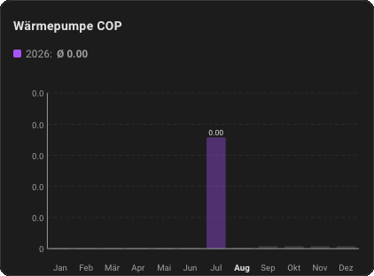

Chaleur produite par unité d'électricité consommée. Axe mis à l'échelle
automatiquement ; la valeur est un nombre (typiquement 2 à 5 environ), pas un
pourcentage, affiché avec 2 décimales. Nécessite deux entités :

- `entity` : énergie électrique consommée (kWh).
- `heat_entity` : énergie thermique produite (kWh, p. ex. depuis HeishaMon).

Valeur mensuelle = chaleur ÷ électricité. Un véritable compteur d'énergie
thermique est nécessaire pour que le résultat ait du sens. La valeur annuelle
est le coefficient de performance annuel Σ chaleur ÷ Σ électricité, et non la
moyenne des douze COP mensuels.

### wp — Pompe à chaleur

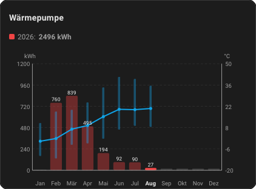

Consommation électrique mensuelle de la pompe à chaleur en kWh (somme du
mois). Superposition facultative :

- `temperature_entity` : un capteur de température extérieure. Trace une
  courbe de température sur sa propre échelle en °C à droite (cet axe a un
  minimum **et** un maximum réels, les mois d'hiver passant sous zéro).
  Résolution via `temp_mode` :
  - `daily` (par défaut) : un point par jour calendaire, comme le graphique
    d'historique de Home Assistant. Se simplifie automatiquement en plage
    mensuelle min/max en dessous d'environ 500 px de largeur de carte, puis en
    simple courbe de moyenne mensuelle en dessous d'environ 280 px, calculée à
    partir des mêmes données journalières sans requête supplémentaire.
  - `minmax` : toujours une plage mensuelle min/max plus une courbe moyenne.
  - `mean` : toujours une simple courbe de moyenne mensuelle.

Entité par défaut : `sensor.waermepumpe`.

### klima — Climatisation

Consommation électrique mensuelle de la climatisation en kWh (somme du mois).
Prend en charge la même superposition facultative `temperature_entity` /
`temp_mode` que `wp` (l'usage de la climatisation suit plutôt les mois
chauds).
Entité par défaut : `sensor.klimaanlage`.

### akku — État de charge batterie

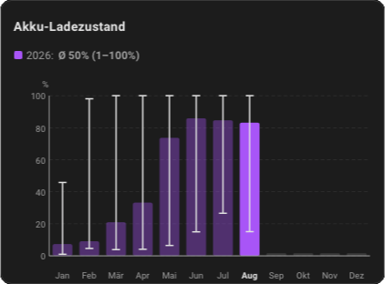

État de charge mensuel de la batterie. Axe Y fixe 0–100 %. La barre part
toujours de 0 (hauteur = moyenne mensuelle, comme tous les autres
préréglages). `stat_mode` choisit l'affichage :

- `mean` (par défaut) : simple moyenne mensuelle.
- `minmax` : le min/max mensuel est superposé sous forme de moustache (un
  trait vertical avec embouts, sur la même échelle que la barre). Dans ce mode
  il n'y a pas d'étiquette chiffrée séparée ; les valeurs exactes Ø/min/max
  figurent dans la ligne de synthèse au-dessus du graphique.

Entité par défaut : `sensor.akku_ladezustand`.

### einspeisung — Injection réseau PV

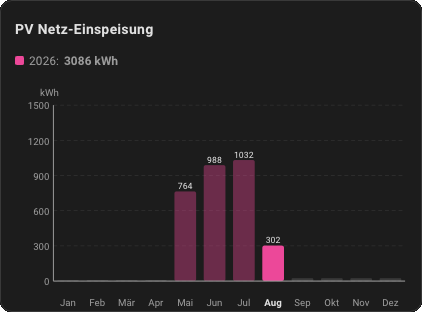

Injection mensuelle sur le réseau en kWh (somme du mois). Ce préréglage n'a
**aucune entité par défaut** : un nom de capteur deviné ne correspondrait à
aucune installation réelle, la carte affiche donc une courte invite
« sélectionner une entité » tant qu'aucune n'est configurée.

### overview — Aperçu électricité

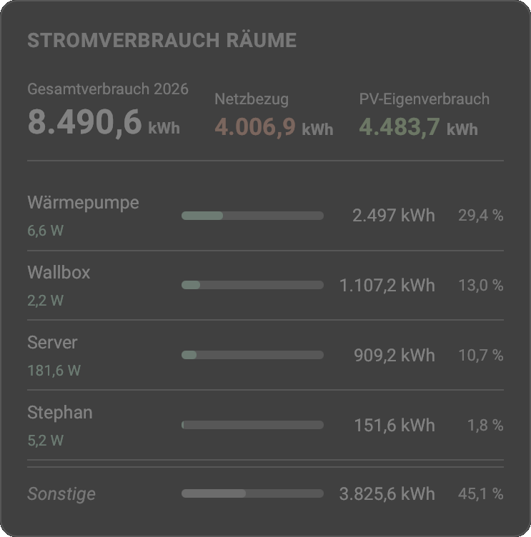

Pas un graphique en barres. Un résumé chiffré du coût et de la consommation
d'électricité de l'année en cours, avec comparaison facultative à l'année
précédente. Configuration :

- `energy_entity` : capteur d'énergie (kWh). **Requis.**
- `price_per_kwh` : prix du kWh en EUR (p. ex. `0.32` pour 32 ct/kWh).
  **Requis.**
- `base_fee_yearly` ou `base_fee_monthly` : abonnement (l'un des deux).
- `base_fee_mode` : `accrued` (par défaut, au prorata de la partie écoulée de
  l'année) ou `full` (le montant entier).
- `currency` : `EUR` par défaut.
- `previous_year_kwh` : valeur manuelle facultative pour l'année précédente.
  Normalement calculée automatiquement à partir des statistiques (1er janvier
  au 31 décembre précédent) ; la renseigner désactive la comparaison sur la
  même période décrite ci-dessous.

La comparaison en pourcentage porte sur la **même période** de l'année
précédente (du 1er janvier à la date d'aujourd'hui il y a un an), et non sur
l'année précédente complète. Une comparaison à l'année complète serait dictée
par le calendrier : en septembre elle afficherait toujours une forte baisse,
quelle que soit l'évolution réelle de la consommation.

### rooms — Consommation par pièce

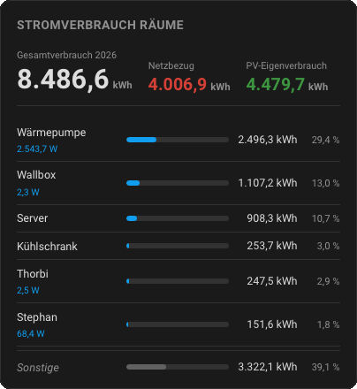

Pas un graphique en barres. kWh annuels par pièce avec la part de chacune dans
le total du logement. Configuration :

- `total_entity` : compteur général ou de soutirage réseau (facultatif,
  p. ex. OBIS 1.8.0). Laisser vide pour une vue limitée aux pièces (part du
  total des pièces, sans ligne « Autres »).
- `pv_entity` : production PV (facultatif, kWh).
- `feedin_entity` : injection réseau (facultatif, kWh). Avec `pv_entity` et
  `feedin_entity` renseignées : consommation réelle = soutirage + (production
  PV − injection). La ligne « Autres » et les parts reflètent alors l'usage
  réel, autoconsommation PV comprise.
- `rooms` : jusqu'à 10 pièces, chacune avec un `name` libre, sa propre
  `entity` d'énergie et une `power_entity` instantanée facultative.

## Installation via HACS

1. HACS → **⋮** → Dépôts personnalisés
2. Saisir l'URL de ce dépôt, catégorie **Dashboard**
3. Installer « Energy-Charts-by-Lutarym »
4. Recharger Home Assistant (vider le cache du navigateur si nécessaire)

## Installation manuelle

Copier `dist/energy-charts-by-lutarym.js` dans `config/www/` :

```yaml
resources:
  - url: /local/energy-charts-by-lutarym.js
    type: module
```

## Utilisation

Ajouter via **Modifier le tableau de bord → Ajouter une carte →
« Energy-Charts-by-Lutarym »**. Cela ouvre directement le formulaire de
configuration graphique, la voie recommandée pour toutes les options
ci-dessous.

```yaml
type: custom:energy-charts-by-lutarym
card_type: pv            # autarkie | energy | pv | wallbox | wallbox_eff | eigenverbrauch | cop | wp | klima | akku | einspeisung | overview | rooms
years_back: 2             # facultatif : 0 | 1 | 2 | 3 années précédentes en plus (défaut : 1) ; préréglages en barres uniquement
show_values: true         # facultatif : le nombre au-dessus de chaque barre (pas la graduation), défaut : true ; préréglages en barres
show_legend: false        # facultatif : petits repères d'année dans le graphique, défaut : false
y_max: null               # facultatif : valeur haute fixe de l'axe Y (laisser vide pour automatique)
y_headroom: 20            # facultatif : espace supplémentaire en % au-dessus de la barre la plus haute en mode automatique (défaut : 20)

# --- akku uniquement ---
stat_mode: mean           # mean | minmax (la barre reste à 0, min/max en moustache, pas d'axe séparé)

# --- pv uniquement ---
kwp: 14.4                 # puissance installée : ligne de référence en pointillés contre une échelle kW à droite
power_entity: sensor.xyz  # capteur de puissance instantanée : pointe mensuelle en trait sur chaque barre

# --- wp / klima uniquement ---
temperature_entity: sensor.aussentemperatur # température extérieure : courbe de température
temp_mode: daily          # daily | minmax | mean (défaut : daily)
color_temp: "#0ea5e9"    # couleur de la courbe de température (défaut : bleu ciel)

# --- wallbox uniquement ---
distance_entity: sensor.auto_odometer # compteur kilométrique ou capteur de trajet : courbe des km parcourus
color_distance: "#84cc16" # couleur de la courbe kilométrique (défaut : vert lime)

# --- wallbox_eff uniquement ---
grid_entity: sensor.grid_power   # requis : soutirage réseau (puissance W/kW ou énergie kWh)

# --- eigenverbrauch uniquement ---
feedin_entity: sensor.pv_feedin  # requis : injection réseau (kWh)

# --- cop uniquement ---
heat_entity: sensor.heat_produced # requis : énergie thermique produite (kWh)

# --- overview uniquement ---
energy_entity: sensor.stromverbrauch # requis
price_per_kwh: 0.32       # requis (EUR par kWh)
base_fee_yearly: 120      # ou base_fee_monthly: 10
base_fee_mode: accrued    # accrued (au prorata) | full
currency: EUR
previous_year_kwh: 4200   # valeur manuelle facultative

# --- rooms uniquement ---
total_entity: sensor.grid_import  # facultatif
pv_entity: sensor.pv_ertrag       # facultatif
# feedin_entity: sensor.pv_feedin # facultatif (voir la section rooms)
rooms:
  - name: Salon
    entity: sensor.room_salon
    power_entity: sensor.room_salon_power  # facultatif
  - name: Bureau
    entity: sensor.room_bureau

# --- apparence (tous les types) ---
color: "#f59e0b"         # couleur principale de l'année en cours
color_prev: "#888888"    # couleur de l'année précédente immédiate
color_text: "#1c1c1c"    # couleur du texte et des valeurs (défaut : suit le thème)
color_dim: "#f59e0b55"   # couleur atténuée (mois écoulés de l'année en cours)
appearance: auto          # auto | light | dark
title: "Mon titre"        # facultatif : remplace le titre du préréglage
title_font_size: 14       # facultatif, défaut 14px
label_font_size: 10       # facultatif, défaut : automatique
```

Survoler une barre à la souris affiche une petite infobulle avec le mois,
l'année et la valeur exacte (Ø avec plage min/max dans le mode min/max de
akku ; les traits de pointe du préréglage pv affichent aussi leur valeur).

### Vue d'ensemble des préréglages

| card_type | Entité par défaut | Titre | Couleur | Entité requise en plus |
|---|---|---|---|---|
| autarkie | sensor.autarkie | Autonomie | `#22c55e` | — |
| energy | sensor.stromverbrauch | Consommation électrique | `#facc15` | — |
| pv | sensor.pv_ertrag | Production PV | `#f59e0b` | — |
| wallbox | sensor.wallbox | Borne de recharge | `#3b82f6` | — |
| wallbox_eff | *(aucune)* | Efficacité de charge | `#6366f1` | `grid_entity` |
| eigenverbrauch | *(aucune)* | Autoconsommation | `#84cc16` | `feedin_entity` |
| cop | *(aucune)* | COP pompe à chaleur | `#d946ef` | `heat_entity` |
| wp | sensor.waermepumpe | Pompe à chaleur | `#ef4444` | — |
| klima | sensor.klimaanlage | Climatisation | `#06b6d4` | — |
| akku | sensor.akku_ladezustand | État de charge batterie | `#8b5cf6` | — |
| einspeisung | *(aucune)* | Injection réseau PV | `#ec4899` | — |
| overview | *(aucune)* | Aperçu électricité | `#0ea5e9` | `energy_entity`, `price_per_kwh` |
| rooms | *(aucune)* | Consommation par pièce | `#10b981` | liste `rooms` |

Les entités par défaut sont des exemples ; saisissez votre propre identifiant
d'entité dans l'éditeur. Les préréglages marqués *(aucune)* n'ont aucune
valeur par défaut et affichent une courte invite « sélectionner une entité »
tant qu'aucune n'est configurée.

En français, la puissance crête s'affiche en kWc dans l'éditeur et sur l'axe
du graphique ; la clé de configuration reste `kwp`.

## Licence

Usage privé.
